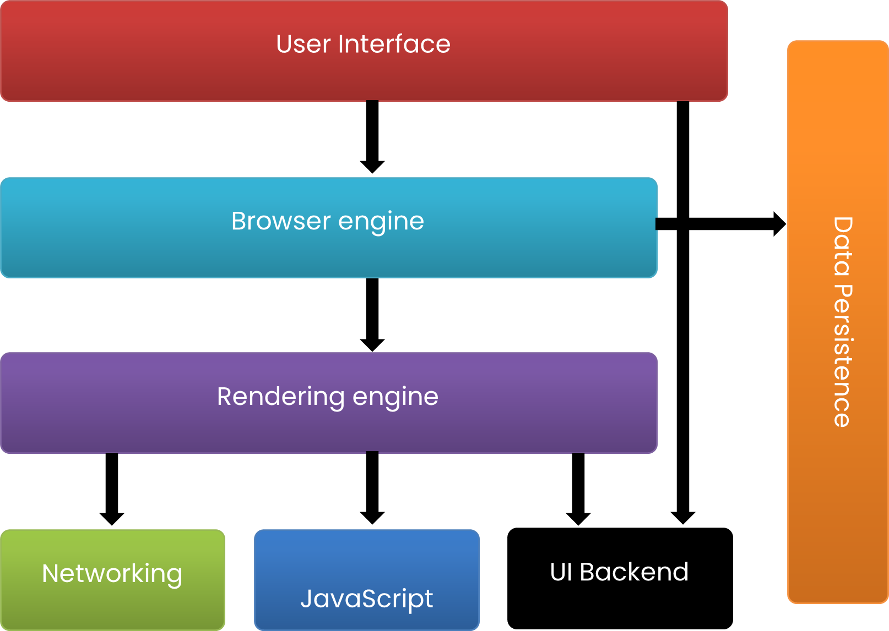

# Main functionality of the browser

The internet browser work begins with a client entering the ideal URL(Uniform Resource Locator) into the location bar of the program. For instance https://www.google.com. Contingent upon the URL prefix, the internet browser deciphers the URL and showcases the substance to the client. The URL prefix gives the convention used to get to the area. HTTP:// and HTTPS:// are the most regularly utilized URL prefixes.

Other generally utilized prefixes incorporate FTP: for File Transfer Protocol to download document or records from a FTP server, record: for documents put away in a capacity gadget locally.

When the asset has been found and deciphered the program will show the substance to the client. The program application changes over satisfied like HTML, CSS, and pictures to an intelligent record in a cycle called delivering. Programs can decipher and show content like video, pictures, text, hyperlinks, and XML documents.

# There are 7 Key Components of Any Web Browser

1. Layout Engine - this takes input from the program (URL bar, search box, mouse snaps, and key presses) and passes them to the delivering motor
2. Rendering Engine - this takes HTML code and deciphers it into what you see visually. For example, a <b> label would be deciphered by the rendering engine as a bunch of instructions to make the text within the component bold.
3. User Interface - This is the visual interpretation of controls in the browser, for example, the back and forward buttons, bookmarks, and all chrome that shows up around the browser window where website is displayed.
4. JavaScript Engine - This engine parses, interprets, and outputs the results of JavaScript code.
5. Network Layer – This is a browser function that works behind the scenes to handle network tasks like encryption, http and ftp requests, and all network settings like timeouts and HTTP status code handling.
6. Data Storage - Browsers must keep some data, such as cached files and cookies, and more recently, browsers have been upgraded to allow data and objects created with JavaScript to be stored.
7. Operating System Interface - The browser should connect with the operating system to draw out a few components of the page like drop-down boxes and the chrome of a window (close, amplify, and limit buttons)

# Rendering engine and its use

When a browser sends a request for HTML files to the server, those HTML files often contain < link >. An element that references an external CSS stylesheet and a < script > element that references an external JavaScript script. It is important to know the order in which these files are parsed by the browser when the browser loads the page.

- The browser first parses the HTML file. This allows the browser to recognize all element references to the external CSS stylesheet and all JavaScript element references to the script.
- When the browser parses the HTML, it sends a request for the CSS file received from < link >. Found back on the server. Parses the elements and JavaScript files found in the < script > elements, and CSS and JavaScript from them.
- The browser generates an in-memory DOM tree from the parsed HTML, generates an in-memory CSSOM structure from the parsed CSS, and compiles and executes the parsed JavaScript.
- When the browser builds the DOM tree, applies styles from the CSSOM tree, and executes JavaScript, the visual representation of the page is drawn on the screen and the user can see the content of the page and start working on it.

# HTML & CSS Parsing

The first step in this parsing process is to split the HTML into start tags, end tags, and tokens that represent their content. From that it builds the DOM.

Like HTML and DOM, CSS files need to be parsed at load time and converted into a tree (this time CSSOM). Describes all CSS selectors on the page, their hierarchies, and their properties. The difference between CSSOM and DOM is that CSS rules can overwrite each other in different places due to their specificity and cannot be built in stages. For this reason, CSS blocks rendering because the browser cannot know where and how to place each element on the screen until all CSS has been parsed and CSSOM built.

# Order of script processing

The web model is synchronous. The author expects the script to be parsed and executed as soon as the parser reaches the Deleted tag. Document parsing will stop until the script finishes running. If the script is external, the resource must first be fetched from the network. This also runs synchronously and stops the analysis until the resource is fetched.
